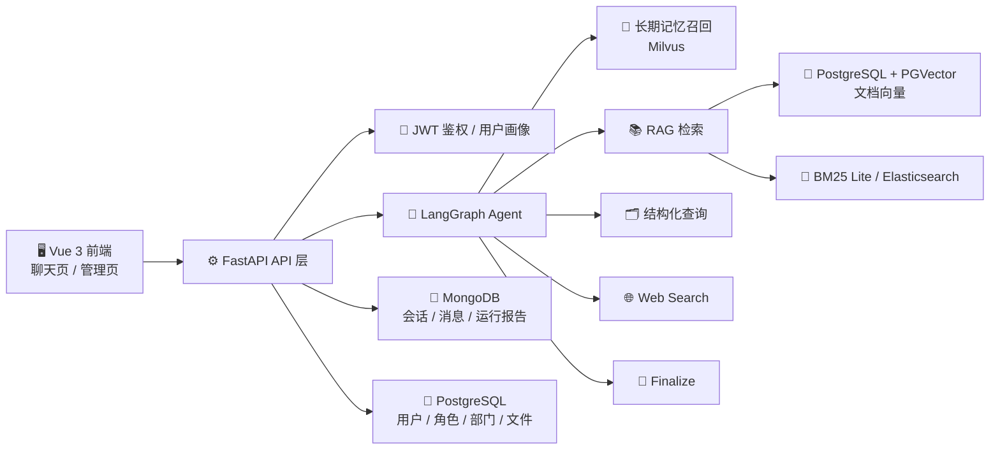

<div align="center">

# 🧠 Enterprise RAG Agent

**面向企业内部知识库、权限问答、会话追踪与长期记忆场景的 Agentic RAG 全栈项目**

[](https://github.com/edenxie-xgk/enterprise-repository/actions/workflows/preferred-topics-tests.yml)


</div>

> 这是一个把“文档知识库 + Agent 路由 + 权限控制 + 长期记忆 + 监控面板”串起来的完整项目，适合作为企业内部智能问答系统的原型、教学项目或最小可用版本。

## ✨ 项目简介

这个仓库的目标，不是做一个只会聊天的 Demo，而是做一套更贴近企业内部实际场景的 Agentic RAG 系统：

- 用户可以上传企业文档，系统自动切块、向量化并入库。
- Agent 会根据问题类型自动决定是直接回答、做知识库检索、做结构化查询，还是补充 Web 搜索。
- 检索链路会结合权限范围，避免把用户无权访问的内容带进答案。
- 系统会记录会话、运行报告、引用信息和追踪数据，方便后续排查与监控。
- 文档向量保留在 `PGVector`，长期记忆单独接入 `Milvus`，两条链路职责分离。

一句话概括：

**文档知识库走 PGVector，长期记忆走 Milvus，业务权限和账号体系走 PostgreSQL，会话与运行记录走 MongoDB。**

## 🎯 适用场景

- 企业内部制度、流程、规范、操作手册问答
- 按部门或角色控制访问范围的知识检索
- 文件上传后自动入库、自动检索、自动生成带引用回答
- 带长期记忆能力的企业助手，例如记住用户语言偏好、回答风格、常用上下文
- 对会话、运行轨迹、失败原因和使用情况有可观测需求的 Agent 系统

## 🚀 核心能力

| 能力 | 说明 |
| --- | --- |
| 📄 多格式文档入库 | 支持 `txt / docx / md / pdf / xlsx / csv / pptx / json / 图片` |
| 🔍 混合检索 | 支持向量检索 + BM25 检索 + RRF 融合 |
| 🧭 Agent 路由 | 支持 `direct_answer`、`rag`、`db_search`、`web_search` 等动作 |
| 🔐 权限过滤 | 检索时可按 `department_id`、`user_id` 等元数据限制访问范围 |
| 🧠 长期记忆 | 支持记住用户偏好、任务上下文，并在后续会话中召回 |
| 📡 流式输出 | 聊天接口通过 SSE 返回增量内容与运行摘要 |
| 📊 运行监控 | 管理端可查看请求量、失败率、模型分布、运行明细 |
| 🐳 Docker 部署 | 已整理为单一 `docker-compose.yml`，更适合新手与云部署 |

## 🏗️ 架构概览



## 🧭 Agent 主链路

当前主流程可以简化理解成下面这条线：

1. `resolved_query` 先把用户问题和上下文整理成可执行查询。
2. `memory_recall` 先尝试从长期记忆里召回和当前问题相关的偏好或历史事实。
3. `agent` 根据当前状态决定下一步动作。
4. 动作可能进入 `direct_answer`、`rag`、`db_search`、`web_search`、`rewrite_query`、`expand_query`、`decompose_query`。
5. `finalize` 汇总答案、引用、运行摘要和中间轨迹，输出最终结果。

这意味着它不是“固定一次检索再回答”，而是一个带策略判断、带中间步骤、带长期记忆的 Agent 工作流。

## 🧩 技术栈

| 层次 | 技术 |
| --- | --- |
| 后端 API | FastAPI、Uvicorn |
| Agent 编排 | LangGraph、LangChain |
| RAG 框架 | LlamaIndex |
| 向量知识库 | PostgreSQL、PGVector |
| 长期记忆 | Milvus |
| 会话与运行记录 | MongoDB |
| 稀疏检索 | BM25 Lite 或 Elasticsearch |
| ORM / 数据层 | SQLModel、SQLAlchemy、asyncpg、Alembic |
| 模型接入 | OpenAI、DeepSeek、Hugging Face、智谱 |
| 文档解析 | PyMuPDF、PaddleOCR、python-docx、pandas、python-pptx |
| 前端 | Vue 3、Vite、Element Plus、Tailwind CSS、ECharts |
| 测试 / CI | unittest、GitHub Actions |

## 📂 目录结构

```text
rag-agent/
├─ app.py                   # 启动入口
├─ core/                    # 全局配置、基础类型
├─ service/                 # FastAPI、鉴权、SQLModel、业务路由
├─ src/
│  ├─ agent/                # LangGraph 图、路由、策略、运行器
│  ├─ nodes/                # Agent 节点实现
│  ├─ rag/                  # 文档入库、检索、重排、上下文构造
│  ├─ memory/               # 长期记忆服务、写回、Milvus 存储
│  ├─ models/               # LLM / Embedding / Reranker 封装
│  ├─ prompts/              # 提示词模板
│  └─ types/                # 状态对象、返回对象、记忆对象
├─ web_service/             # Vue 3 前端
├─ tests/                   # 单元测试和冒烟测试
├─ alembic/                 # 数据库迁移
├─ docker/                  # 容器启动脚本
├─ deploy/                  # 中文部署说明
├─ Dockerfile               # 后端镜像
├─ docker-compose.yml       # 单文件部署编排
└─ .env.example             # 环境变量模板
```

## 🧱 核心模块职责

| 模块 | 职责 |
| --- | --- |
| `core/` | 统一读取环境变量、定义项目级基础类型 |
| `service/` | FastAPI 应用、鉴权依赖、数据库连接、业务路由和工具函数 |
| `src/agent/` | 组织整个 Agent 状态图和动作路由 |
| `src/nodes/` | 实现每一个节点的实际逻辑，例如检索、改写、总结、长期记忆召回 |
| `src/rag/` | 管理文档解析、切块、向量化、检索、融合、重排和上下文构造 |
| `src/memory/` | 管理长期记忆召回、写回、去重和 Milvus 存储适配 |
| `web_service/` | 提供聊天界面、管理后台和接口调用封装 |
| `tests/` | 覆盖偏好主题、密码、文件、长期记忆、API 冒烟等关键逻辑 |

## ⚡ 最快启动方式

推荐优先使用 Docker，这也是当前最容易跑起来的方式。

### 1. 复制环境变量模板

Linux / macOS:

```bash
cp .env.example .env
```

Windows PowerShell:

```powershell
Copy-Item .env.example .env
```

### 2. 第一次只改最关键的配置

建议至少检查这些字段：

- `JWT_SECRET_KEY`
- `OPENAI_API_KEY` 或 `DEEPSEEK_API_KEY`
- `DOCKER_MILVUS_URI`
- `POSTGRES_PASSWORD`
- `FRONTEND_PORT`
- `CORS_ALLOW_ORIGINS`

如果你只是本地 Docker 试跑，通常只需要先重点看这几项。

### 3. 一键启动

```bash
docker compose up -d --build
```

### 4. 查看状态

```bash
docker compose ps
docker compose logs -f backend
```

### 5. 访问地址

- 前端首页：`http://127.0.0.1:8080`
- 接口文档：`http://127.0.0.1:8080/api/docs`

说明：

- 当前默认只对外暴露前端端口。
- 后端、PostgreSQL、MongoDB 默认不直接暴露到公网。
- 前端通过 Nginx 反向代理访问后端接口。

## 🛠️ 源码开发方式

如果你想本地调试源码，而不是直接跑 Docker 镜像，可以按下面的方式启动。

### 后端

```powershell
python -m venv .venv
.\.venv\Scripts\Activate.ps1
pip install -r requirements.txt
alembic upgrade head
python app.py
```

Windows 说明：

- 主应用已经不再内置 `PaddleOCR` 依赖，OCR 统一通过仓库里的 `ocr_service/` 提供。
- 这样可以避免 `PaddleOCR 3.x` 及其依赖链影响主应用里的 `langchain`、`llama-index` 等核心包。
- 启动主应用前，请先启动 `ocr_service`，并在 `.env` 里配置 `OCR_SERVICE_URL`。

### 前端

```powershell
cd web_service
npm install
npm run dev
```

开发模式下你需要自己准备好这些依赖服务：

- PostgreSQL + PGVector
- MongoDB
- Milvus

推荐版本：

- Python `3.11`
- Node.js `18+`

## 🔑 关键环境变量

| 变量 | 作用 |
| --- | --- |
| `JWT_SECRET_KEY` | JWT 签名密钥，必须改成随机长字符串 |
| `OPENAI_API_KEY` / `DEEPSEEK_API_KEY` | 至少配置一个模型提供方 |
| `POSTGRES_PASSWORD` | PostgreSQL 密码 |
| `CORS_ALLOW_ORIGINS` | 前端可访问的来源地址 |
| `DOCKER_MILVUS_URI` | Docker 环境里连接 Milvus 的地址 |
| `MEMORY_ENABLED` | 是否启用长期记忆 |
| `MEMORY_WRITE_ENABLED` | 是否允许把对话写入长期记忆 |
| `BM25_RETRIEVAL_MODE` | 稀疏检索模式，默认 `lite`，可选 `es` |

`.env.example` 顶部已经按“第一次部署先看哪些字段”的思路整理过，新手可以直接从顶部开始改。

## 📥 文档入库流程

上传文档后的主流程如下：

1. 前端调用 `/file/upload` 上传文件。
2. 后端校验用户权限、文件类型和大小。
3. 原文件写入 `service/public/uploads/`。
4. RAG 服务解析文档并按类型切块。
5. 文档块向量写入 `PGVector`。
6. 原始块内容和相关元数据写入 `MongoDB` 或 Elasticsearch。
7. 文件状态从“处理中”更新为“成功”或“失败”。

## 💬 查询流程

用户问一个问题时，系统会经历下面几个关键步骤：

1. 识别用户身份并加载用户画像。
2. 读取最近会话历史，做上下文归一化。
3. 先召回长期记忆，看有没有和当前问题相关的偏好或历史事实。
4. Agent 决定当前问题走哪条路径。
5. 如果走 `rag`，就执行向量检索、BM25 检索、融合、重排和上下文构建。
6. 如果走 `db_search`，就查询结构化业务信息。
7. 如果走 `web_search`，就补充外部信息。
8. 最终统一进入 `finalize` 输出答案、引用、轨迹和摘要。

## 🧠 长期记忆设计

这个项目当前的长期记忆路线是：

- **文档知识库**：继续使用 `PostgreSQL + PGVector`
- **长期记忆**：单独使用 `Milvus`
- **会话记录 / 运行报告**：使用 `MongoDB`
- **用户 / 角色 / 权限 / 文件业务表**：使用 `PostgreSQL`

这样做的好处是职责更清晰：

- 文档检索链路不需要迁移，继续保持 PGVector 即可。
- 长期记忆单独存储，便于后续扩展召回策略、去重逻辑和记忆类型。
- 记忆与文档知识库不混在一起，后期维护更清楚。

当前仓库里已经包含：

- 长期记忆召回节点：`src/nodes/memory_recall_node.py`
- 长期记忆服务：`src/memory/service.py`
- Milvus 存储适配：`src/memory/store/milvus_store.py`
- 长期记忆测试：`tests/test_long_term_memory.py`

## 🔌 API 概览

| 分类 | 接口 |
| --- | --- |
| 登录 | `POST /user/login` |
| 用户画像 | `GET /user/profile`、`PUT /user/profile` |
| 文件上传 | `POST /file/upload` |
| 文件查询 | `GET /file/query_file` |
| Agent 查询 | `POST /agent/query` |
| 流式聊天 | `POST /agent/chat/stream` |
| 会话列表 | `GET /agent/sessions` |
| 会话消息 | `GET /agent/sessions/{session_id}/messages` |
| 删除会话 | `DELETE /agent/sessions/{session_id}` |
| 管理监控 | `GET /agent/admin/monitor/overview`、`GET /agent/admin/monitor/runs` |

## 🧪 测试与 CI

当前仓库已经有一套基础后端冒烟测试，覆盖这些方向：

- `tests.test_preferred_topics`
- `tests.test_password_utils`
- `tests.test_file_utils`
- `tests.test_long_term_memory`
- `tests.test_api_smoke`

GitHub Actions 工作流会在相关后端文件变更时自动执行这些测试。

本地运行：

```bash
python -m unittest \
  tests.test_preferred_topics \
  tests.test_password_utils \
  tests.test_file_utils \
  tests.test_long_term_memory \
  tests.test_api_smoke
```

## 🐳 Docker 部署说明

当前仓库已经把部署入口收口成更简单的形式：

- 一份编排文件：`docker-compose.yml`
- 一份环境变量模板：`.env.example`

如果你要部署到云服务器，优先看这份文档：

- [deploy/README.zh-CN.md](deploy/README.zh-CN.md)

这份部署说明会带你一步一步完成：

- 服务器准备
- Docker 安装
- 复制 `.env`
- 修改关键配置
- 启动容器
- 查看日志
- 通过公网访问项目

## ⚠️ 当前边界与注意事项

- 登录接口依赖数据库中已存在的用户数据，不是自动注册模式。
- 默认 BM25 使用 `lite` 模式，不强依赖 Elasticsearch。
- 当前 CI 主要还是后端 smoke tests，还不是完整的端到端测试体系。
- 如果要正式上生产，建议补齐 HTTPS、备份、监控告警、资源限额和更严格的权限审计。

## 🗺️ 后续可继续增强的方向

- 更完整的 API 冒烟测试和前后端联调测试
- 更细粒度的长期记忆分类、过期策略和冲突消解
- 更完善的管理后台指标和告警能力
- 更标准的初始化脚本、种子数据和一键部署脚本
- 更完整的企业级安全策略，例如限流、审计和对象存储

## 📚 建议阅读顺序

如果你是第一次接手这个仓库，建议按下面顺序看代码：

1. `service/server.py`
2. `src/agent/graph.py`
3. `src/agent/runner.py`
4. `src/nodes/`
5. `src/rag/rag_service.py`
6. `src/memory/`
7. `web_service/src/view/chat/`

这样最容易把“接口层 -> Agent 编排层 -> RAG 层 -> 长期记忆层 -> 前端交互层”串起来。

