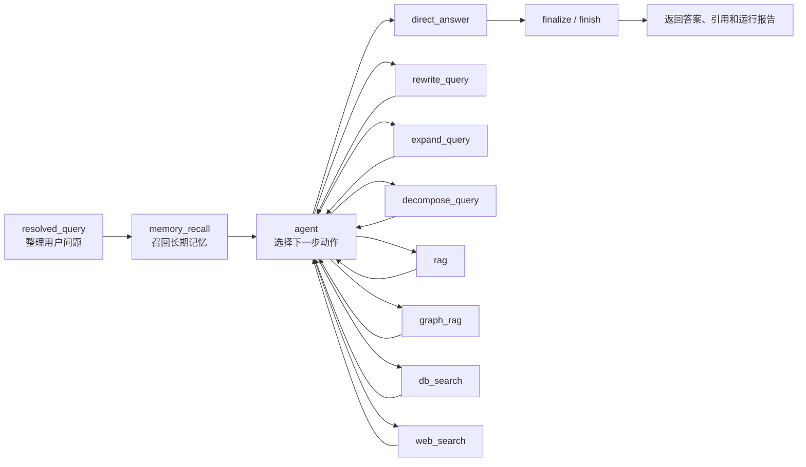

<div align="center">

# 🧠 Enterprise RAG Agent

企业文档问答、权限检索、会话记录、智能体编排和管理后台应用。

[](https://github.com/edenxie-xgk/enterprise-repository/actions/workflows/preferred-topics-tests.yml)


</div>

## 📌 项目说明

本仓库包含一套前后端分离的企业知识库问答系统：

- 🖥️ 前端位于 `web_service/`，使用 Vue 3、Vite、Element Plus、Tailwind CSS 和 ECharts。
- ⚙️ 后端使用 FastAPI，入口为 `app.py` 和 `service/server.py`。
- 🔐 用户通过 `/user/login` 登录，后端使用 Bearer Token 鉴权。
- 📁 用户可上传文档到有权限访问的部门，后端在后台任务中解析、切分、向量化并入库。
- 🔎 文档向量存储使用 PostgreSQL + PGVector，文档块与会话运行记录使用 MongoDB。
- 🧭 Agent 工作流使用 LangGraph 编排，可在 RAG、结构化查询、金融事实图谱、联网搜索、直接回答、查询改写、查询扩展、问题拆解之间路由。
- 🧑‍💼 管理后台包含 Agent 监控、用户管理、部门管理、角色管理和文件管理页面。

## ✅ 当前功能

| 图标 | 模块 | 已有功能 |
| --- | --- | --- |
| 🔐 | 登录与鉴权 | 用户登录、JWT 令牌、管理员接口保护、普通用户接口保护 |
| 👤 | 用户画像 | 回答风格、默认语言、关注主题、是否显示引用、是否允许联网搜索、备注 |
| 🏢 | 部门与角色 | 管理员可维护部门、角色，以及角色可访问的部门范围 |
| 👥 | 用户管理 | 管理员可创建用户、修改用户信息、修改用户密码、分配部门和角色 |
| 📁 | 文件管理 | 文件上传、文件列表、权限范围内下载、管理员文件列表、管理员删除文件 |
| 📄 | 文档解析 | 当前解析器包含 `txt`、`doc/docx`、`md/markdown`、`pdf`、`xls/xlsx`、`csv`、`pptx`、`json`、`jpeg/png/jpg/bmp/webp/tiff/tif` 分支 |
| 🔎 | RAG 检索 | PGVector 稠密检索、BM25 检索、RRF 融合、重排序、证据摘要和引用 |
| 🧭 | Agent 编排 | `resolved_query`、`memory_recall`、`agent`、`rag`、`graph_rag`、`db_search`、`web_search`、`finalize` 等节点 |
| 💬 | 会话 | 流式聊天、会话列表、消息回放、删除会话、运行详情记录 |
| 📊 | 监控 | 今日请求、活跃用户、会话、Token、费用估算、失败率、动作分布、模型分布、运行明细 |
| 🧠 | 长期记忆 | 在 `MEMORY_ENABLED=true` 且 `MEMORY_BACKEND=milvus` 时使用 Milvus 召回长期记忆 |
| ✍️ | 记忆写回 | 在 `MEMORY_ENABLED=true` 且 `MEMORY_WRITE_ENABLED=true` 时写入长期记忆 |
| 🌐 | 联网搜索 | 在用户画像允许联网搜索时，可通过智谱 AI Web Search 获取公开信息 |
| 🧮 | 结构化查询 | 支持可访问部门、可访问文件数量、最近文件、个人上传文件、角色部门范围等查询 |
| 🧾 | 金融事实图谱 | 在 `GRAPH_ENABLED=true` 时抽取金融事实并支持 `graph_rag` 查询 |
| 🧰 | 辅助脚本 | 数据库初始化、种子数据导入、PostgreSQL/MongoDB 导入导出、QA 数据生成、金融事实 LoRA 数据处理脚本 |

## 🧭 Agent 工作流

当前 LangGraph 主链路在 `src/agent/graph.py` 中定义：



动作定义位于 `src/agent/action_registry.py`，策略判断位于 `src/agent/policy.py`。

## 🧱 技术组成

| 层级 | 当前使用 |
| --- | --- |
| 后端服务 | FastAPI、Uvicorn |
| Agent 编排 | LangGraph、LangChain |
| RAG 框架 | LlamaIndex |
| 向量存储 | PostgreSQL、PGVector |
| 文档块与会话记录 | MongoDB |
| 长期记忆 | Milvus |
| 稀疏检索 | BM25 Lite，或配置为 Elasticsearch |
| ORM 与迁移 | SQLModel、SQLAlchemy、asyncpg、Alembic |
| LLM 接入 | OpenAI、DeepSeek |
| 联网搜索 | 智谱 AI Web Search |
| 文档解析 | PyMuPDF、python-docx、pandas、python-pptx、OpenCV、远程 OCR 服务 |
| 前端 | Vue 3、Vite、Vue Router、Element Plus、Tailwind CSS、ECharts |
| 容器 | Dockerfile、docker-compose.yml、Nginx |
| 测试与 CI | unittest、GitHub Actions |

## 📂 目录结构

```text
enterprise-repository/
├─ app.py                         # 后端启动入口
├─ core/                          # 全局配置与通用类型
├─ service/                       # FastAPI 服务、路由、模型、鉴权、数据库初始化
│  ├─ router/                     # user / file / role / agent 路由
│  ├─ models/                     # SQLModel 数据模型
│  ├─ dependencies/               # 鉴权依赖
│  ├─ utils/                      # JWT、密码、文件、访问控制、会话存储等工具
│  └─ public/uploads/             # 本地上传文件目录
├─ src/
│  ├─ agent/                      # Agent 策略、路由、运行器、动作注册
│  ├─ nodes/                      # LangGraph 节点
│  ├─ rag/                        # 文档解析、切分、检索、重排、生成、向量存储
│  ├─ memory/                     # 长期记忆召回、写回、Milvus 存储
│  ├─ graph/                      # 金融事实图谱抽取、存储、查询
│  ├─ models/                     # LLM、Embedding、Reranker 封装
│  ├─ tools/                      # RAG、DB Search、Web Search 等工具
│  ├─ prompts/                    # Agent、RAG、Graph 提示词
│  └─ types/                      # 状态、事件、RAG、记忆、图谱等类型
├─ web_service/                   # Vue 前端与 Nginx 配置
├─ ocr_service/                   # 独立 OCR 微服务
├─ scripts/                       # 初始化、导入导出、QA 数据、金融事实训练数据脚本
├─ db/                            # 示例种子数据与导出的数据库数据
├─ alembic/                       # 数据库迁移
├─ tests/                         # 后端测试
├─ docker/                        # 后端容器入口脚本
├─ Dockerfile                     # 后端镜像
├─ docker-compose.yml             # 本地容器编排
├─ requirements.txt               # 后端依赖
└─ .env.example                   # 环境变量模板
```

## 🐳 Docker 启动

### 1. 准备环境变量

Windows PowerShell：

```powershell
Copy-Item .env.example .env
```

Linux / macOS：

```bash
cp .env.example .env
```

至少检查这些变量：

| 变量 | 用途 |
| --- | --- |
| `JWT_SECRET_KEY` | JWT 签名密钥 |
| `OPENAI_API_KEY` | OpenAI 模型调用 |
| `DEEPSEEK_API_KEY` | DeepSeek 模型调用 |
| `ZHIPUAI_API_KEY` | Web Search 调用 |
| `POSTGRES_PASSWORD` | PostgreSQL 密码 |
| `FRONTEND_PORT` | 前端容器对外端口 |
| `CORS_ALLOW_ORIGINS` | 允许访问后端的前端地址 |
| `OCR_SERVICE_URL` | OCR 服务地址 |

`.env.example` 中包含启动种子数据配置：

```env
BOOTSTRAP_ADMIN_USERNAME=admin
BOOTSTRAP_ADMIN_PASSWORD=Admin@123456
```

### 2. 启动服务

```bash
docker compose up -d --build
```

查看容器状态：

```bash
docker compose ps
```

查看后端日志：

```bash
docker compose logs -f backend
```

### 3. 访问地址

| 入口 | 地址 |
| --- | --- |
| 前端 | `http://127.0.0.1:8080` |
| API 文档 | `http://127.0.0.1:8080/api/docs` |

Docker Compose 当前包含：

- `postgres`：PostgreSQL + PGVector
- `mongo`：MongoDB
- `milvus-etcd`：Milvus 依赖
- `milvus-minio`：Milvus 依赖
- `milvus`：Milvus Standalone
- `backend`：FastAPI 后端
- `frontend`：Vue 构建产物 + Nginx

## 🛠️ 源码启动

### 后端

```powershell
python -m venv .venv
.\.venv\Scripts\Activate.ps1
pip install -r requirements.txt
Copy-Item .env.example .env
```

启动数据库依赖：

```bash
docker compose up -d postgres mongo milvus
```

初始化数据库结构与种子数据：

```bash
python scripts/init_project.py --mode auto
```

启动后端：

```bash
python app.py
```

源码方式启动后，后端 API 文档地址为：

```text
http://127.0.0.1:1016/docs
```

### 前端

```powershell
cd web_service
npm install
npm run dev
```

前端 API 地址由 `VITE_API_BASE_URL` 控制；未设置时，前端会访问当前主机的 `1016` 端口。

## 👁️ OCR 服务

OCR 服务位于 `ocr_service/`，当前没有放入 `docker-compose.yml`。PDF 扫描页和图片解析会调用远程 OCR 接口。

启动 OCR 服务：

```powershell
cd ocr_service
python -m venv .venv
.\.venv\Scripts\Activate.ps1
pip install -r requirements.txt
uvicorn app:app --host 127.0.0.1 --port 8016
```

后端 `.env` 中配置：

```env
OCR_SERVICE_URL=http://127.0.0.1:8016
OCR_SERVICE_TIMEOUT_SECONDS=120
OCR_LANG=ch
OCR_MIN_SCORE=0.5
```

如果后端运行在 Docker 容器内，`OCR_SERVICE_URL` 需要填写容器可访问的地址。

## ⚙️ 关键配置

| 配置 | 当前作用 |
| --- | --- |
| `APP_ENV` | 应用环境，取值为 `development`、`staging`、`production` |
| `SERVER_HOST` / `SERVER_PORT` | 后端监听地址与端口 |
| `DATABASE_STRING` | PostgreSQL 同步连接字符串，用于迁移和 PGVector |
| `DATABASE_ASYNC_STRING` | PostgreSQL 异步连接字符串，用于 FastAPI 数据库访问 |
| `MONGODB_URL` / `MONGODB_DB_NAME` | MongoDB 连接配置 |
| `VECTOR_TABLE_NAME` | PGVector 文档向量表名 |
| `EMBEDDING_MODEL` / `EMBEDDING_DIM` | Embedding 模型与向量维度 |
| `BM25_RETRIEVAL_MODE` | BM25 后端，支持 `lite` 或 `es` |
| `ELASTICSEARCH_URL` | `BM25_RETRIEVAL_MODE=es` 时使用 |
| `RERANKER_TYPE` | 重排序方式，支持 `cross-encoder` 或 `llm` |
| `RERANKER_MODEL` | Cross Encoder 重排序模型 |
| `AGENT_MAX_STEPS` | Agent 单次运行最大步数 |
| `AGENT_CHAT_HISTORY_LIMIT` | 会话上下文读取条数 |
| `AGENT_OUTPUT_LEVEL` | 默认回答详细程度 |
| `MEMORY_ENABLED` | 是否启用长期记忆 |
| `MEMORY_WRITE_ENABLED` | 是否写入长期记忆 |
| `MEMORY_BACKEND` | 长期记忆后端，当前实现包含 `milvus` 和 `disabled` |
| `MILVUS_URI` | 后端访问 Milvus 的地址 |
| `GRAPH_ENABLED` | 是否启用金融事实图谱 |
| `UPLOAD_MAX_SIZE_MB` | 上传文件大小限制 |
| `UPLOAD_ALLOWED_EXTENSIONS` | 上传扩展名白名单 |

## 🔌 API 概览

| 分类 | 接口 |
| --- | --- |
| 用户登录 | `POST /user/login` |
| 用户画像 | `GET /user/profile`、`PUT /user/profile` |
| 用户管理 | `GET /user/admin/meta`、`GET /user/admin/users`、`POST /user/admin/users`、`PUT /user/admin/users/{user_id}` |
| 部门与角色 | `GET /role/admin/meta`、`GET /role/admin/departments`、`POST /role/admin/departments`、`PUT /role/admin/departments/{dept_id}`、`DELETE /role/admin/departments/{dept_id}`、`GET /role/admin/roles`、`POST /role/admin/roles`、`PUT /role/admin/roles/{role_id}`、`DELETE /role/admin/roles/{role_id}` |
| 当前角色权限 | `GET /role/department_role` |
| 文件上传 | `POST /file/upload` |
| 文件查询 | `GET /file/departments`、`GET /file/query_file` |
| 文件下载 | `GET /file/files/{file_id}/download` |
| 文件管理 | `GET /file/admin/files`、`DELETE /file/admin/files/{file_id}` |
| Agent 查询 | `POST /agent/query` |
| 流式聊天 | `POST /agent/chat/stream` |
| 会话 | `GET /agent/sessions`、`GET /agent/sessions/{session_id}/messages`、`DELETE /agent/sessions/{session_id}` |
| Agent 监控 | `GET /agent/admin/monitor/overview`、`GET /agent/admin/monitor/runs` |

## 🖥️ 前端页面

| 路由 | 页面 |
| --- | --- |
| `/#/chat` | 聊天、登录、会话、文件上传、用户画像设置 |
| `/#/admin/agent-overview` | Agent 监控总览 |
| `/#/admin/agent-analytics` | Agent 分析图表 |
| `/#/admin/agent-runs` | Agent 运行记录 |
| `/#/admin/users` | 用户管理 |
| `/#/admin/departments` | 部门管理 |
| `/#/admin/roles` | 角色管理 |
| `/#/admin/files` | 文件管理 |

管理员页面由前端路由守卫和后端管理员鉴权共同限制。

## 🗄️ 数据存储

| 存储 | 内容 |
| --- | --- |
| PostgreSQL | 用户、部门、角色、角色部门映射、文件记录、PGVector 文档向量 |
| MongoDB | 文档块、QA 数据、聊天会话、消息、Agent 运行报告 |
| Milvus | 长期记忆向量，需开启长期记忆配置 |
| Elasticsearch | 可选 BM25 检索后端 |
| 本地文件系统 | 上传原文件，默认目录为 `service/public/uploads/` |

## 🧰 脚本

| 脚本 | 用途 |
| --- | --- |
| `scripts/init_project.py` | 初始化数据库结构并写入种子数据 |
| `scripts/export_db_exports.py` | 导出 PostgreSQL / MongoDB 数据到 `db/` |
| `scripts/import_db_exports.py` | 从 `db/` 导入 PostgreSQL / MongoDB 数据 |
| `scripts/generate_qa_dataset.py` | 从已入库文档生成 QA 数据，或回滚 QA 源文档状态 |
| `scripts/export_financial_fact_lora.py` | 从金融事实图谱导出 LoRA 训练 JSONL |
| `scripts/prepare_financial_fact_lora_from_hf.py` | 从 Hugging Face 数据集准备金融事实 LoRA 训练 JSONL |
| `scripts/train_financial_fact_extractor.py` | 训练金融事实抽取 LoRA 适配器 |

训练相关依赖位于 `requirements-train.txt`。

## 🧪 测试与 CI

GitHub Actions 工作流位于 `.github/workflows/preferred-topics-tests.yml`。

CI 当前执行：

```bash
python -m compileall app.py core service src tests
python -m unittest \
  tests.test_preferred_topics \
  tests.test_password_utils \
  tests.test_file_utils \
  tests.test_long_term_memory \
  tests.test_api_smoke
```

本地运行同一组测试：

```powershell
python -m unittest `
  tests.test_preferred_topics `
  tests.test_password_utils `
  tests.test_file_utils `
  tests.test_long_term_memory `
  tests.test_api_smoke
```

## ⚠️ 当前边界

- 🔑 当前没有开放注册接口，用户由管理员创建或由启动种子数据写入。
- 🧾 `UPLOAD_ALLOWED_EXTENSIONS` 中包含 `gif`，但当前 `src/rag/ingestion/loader.py` 没有 `gif` 解析分支。
- 👁️ OCR 依赖独立的 `ocr_service/`，`docker-compose.yml` 当前不启动 OCR 容器。
- 🧠 长期记忆默认关闭，需要同时配置 `MEMORY_ENABLED`、`MEMORY_BACKEND`、`MILVUS_URI` 等变量。
- ✍️ 记忆写回默认关闭，需要开启 `MEMORY_WRITE_ENABLED`。
- 🧾 金融事实图谱默认关闭，需要开启 `GRAPH_ENABLED`。
- 🌐 联网搜索依赖 `ZHIPUAI_API_KEY`，并受用户画像中的 `allow_web_search` 控制。
- 🧪 当前 CI 工作流运行后端 smoke tests，不包含前端构建测试和端到端测试。
